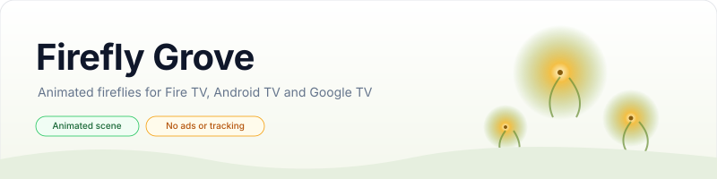
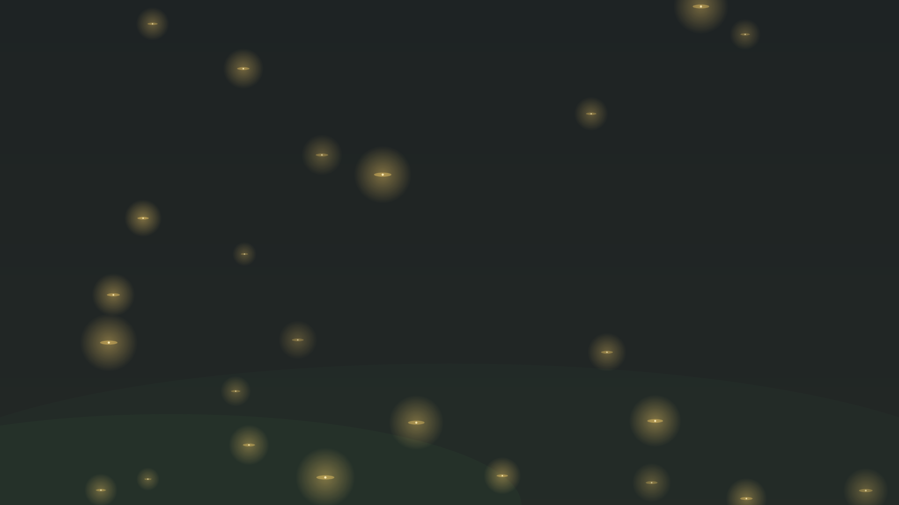
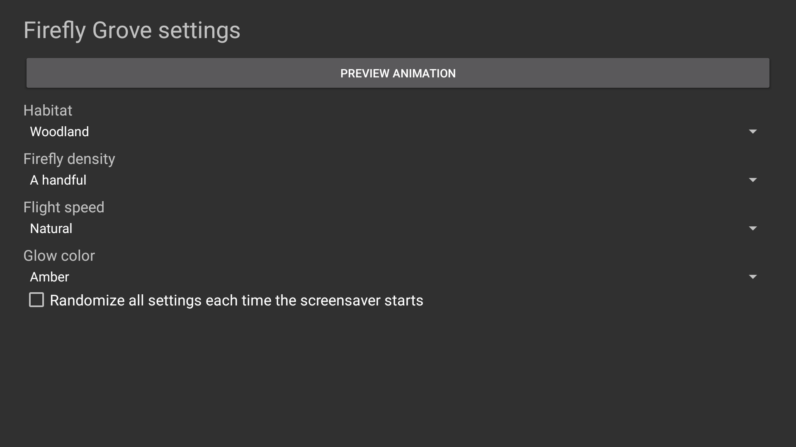

    <picture>
        <source media="(prefers-color-scheme: dark)" srcset="art/banner-dark.svg">
        <source media="(prefers-color-scheme: light)" srcset="art/banner-light.svg">
        
    </picture>

An animated firefly night scene for Fire TV, Android TV, and Google TV.

## Table of Contents

- [Privacy](#privacy)
- [Features](#features)
- [Requirements](#requirements)
- [Installation](#installation)
- [Configuration](#configuration)
- [Screenshots](#screenshots)
- [Building and testing](#building-and-testing)
- [Documentation](#documentation)
- [Releases](#releases)
- [License](#license)

## Privacy

Firefly Grove has no ads, analytics, tracking, telemetry, crash reporting, or runtime network access. The app does not request internet permission. The optional standalone installer makes a user-initiated request to GitHub to download this repository's latest APK and checksum; it sends no device or usage data.

## Features

- Continuously animated fireflies drift through a softly lit night habitat.
- Choose woodland, meadow, or riverbank backgrounds.
- Set a few, a handful, many, a ton, or schools of fireflies.
- Adjust flight speed and amber, lime, or aqua glow.
- Randomize each setting independently or choose all settings randomly each time the screensaver starts.
- Android TV, Google TV, and Fire TV DreamService integration with remote-friendly settings and preview.
- Exported, documented settings provider for host-app discovery.

## Requirements

Android 6.0 (API 23) or later. The app is built for Android TV-class devices. Fire TV, Android TV, and Google TV activation depends on each vendor's system screensaver support. Tested device results are documented in [verification](docs/VERIFICATION.md).

## Installation

Connect to the TV with ADB, then run `python3 install.py --serial TV_IP:5555`. The installer verifies the release APK against its published SHA-256 before installing or updating. Select Firefly Grove in the TV's screensaver or ambient display settings afterward. See [installation](docs/INSTALLATION.md) for local builds and removal.

## Configuration

Open Firefly Grove from the TV launcher to change habitat, firefly density, speed, glow color, and per-setting random choices. See [configuration](docs/CONFIGURATION.md) for the settings-provider contract.

## Screenshots

These captures are from Firefly Grove running on an Android TV emulator after the scene appeared.

## Building and testing

Requires JDK 17+, Android SDK platform 36, build-tools 36.0.0, Python 3, and ADB for device installation. Run `bash build.sh` to build a signed local APK. Run `bash test.sh`, `bash scripts/test-coverage.sh`, `bash scripts/test-python-coverage.sh`, `bash scripts/check-style.sh`, `python3 scripts/check-docs.py`, and `python3 scripts/check-privacy.py` for checks. Details are in [building](docs/BUILDING.md), [testing](docs/TESTING.md), and [CI](docs/CI.md).

## Documentation

- [Architecture](docs/ARCHITECTURE.md)
- [Building](docs/BUILDING.md)
- [CI](docs/CI.md)
- [Configuration](docs/CONFIGURATION.md)
- [Installation and removal](docs/INSTALLATION.md)
- [Release process](docs/RELEASING.md)
- [Testing](docs/TESTING.md)
- [Troubleshooting](docs/TROUBLESHOOTING.md)
- [Device verification](docs/VERIFICATION.md)

Show some love by starring this repository on GitHub. The link opens the repository so signed-in visitors can select Star.

## Releases

- [Firefly Grove 1.0.0 release notes](docs/releases/v1.0.0.md)

## License

Firefly Grove is licensed under the [Apache License, Version 2.0](LICENSE). See [NOTICE](NOTICE) for project notices.
